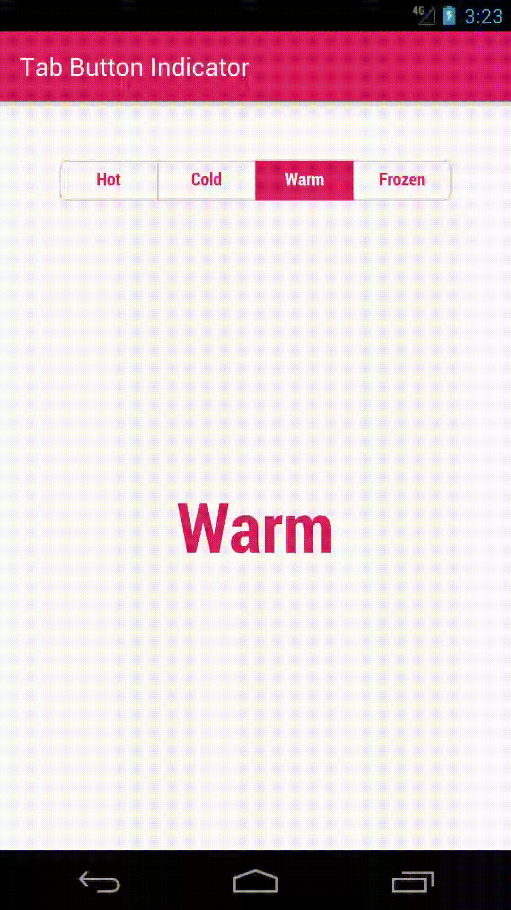

# Tab Button Indicator
[](https://jitpack.io/#raquezha/tab-button-indicator)

A simple indicator that you can use in ViewPager



# Getting Started

Add it in your root build.gradle at the end of repositories:

```groovy
allprojects {
    repositories {
        ...
        maven { url 'https://jitpack.io' }
    }
}
```

Add the dependency:

```groovy
dependencies {
    implementation 'com.github.raquezha:tab-button-indicator:1.0'
}
```

# Layout

check the module sample or

```xml
<net.raquezha.buttonindicator.ButtonIndicator
        android:id="@+id/indicator" 
        android:layout_width="match_parent"
        android:layout_height="32dp"
        android:layout_margin="24dp"
        app:textSize="16sp"
        app:tabCornerRadius="18"
        app:tabStrokeWidth="1"
        app:selectedTextColor="@android:color/white"
        app:tabStrokeColor="@color/defaultColor"
        app:normalTextColor="@color/defaultColor"
        app:selectedBackground="@color/defaultColor"/>
```

#### Customizable Attributes

-   android:textAppearance
-   android:textSize
-   tabCornerRadius
-   cornerRadiusTopLeft
-   cornerRadiusBottomLeft
-   cornerRadiusTopRight
-   cornerRadiusBottomRight
-   selectedTextColor
-   normalTextColor
-   selectedBackground
-   tabStrokeColor
-   tabStrokeWidth

#### Note: 
if you use *cornerRadius* it will override *cornerRadiusTopLeft*, *cornerRadiusBottomLeft* etc.
   
   
   
# ViewPager

```kotlin
private lateinit var labels: ArrayList<String>
    
class MainActivity : AppCompatActivity() {

    override fun onCreate(savedInstanceState: Bundle?) {
        super.onCreate(savedInstanceState)
        setContentView(R.layout.activity_sample)

        // initialize button labels
        labels = arrayListOf(
            getString(R.string.tab_hot),
            getString(R.string.tab_cold),
            getString(R.string.tab_warm),
            getString(R.string.tab_frozen)
        )

        // IMPORTANT TO CALL THIS!!
        indicator.initializeButtons(labels)


        // VIEW PAGER ADAPTER
        val items = labels
        val adapter = SampleAdapter(this@MainActivity, items)
        vpSample.adapter = adapter

        vpSample.registerOnPageChangeCallback(object : ViewPager2.OnPageChangeCallback() {
            override fun onPageSelected(position: Int) {
                // IMPORTANT TO CALL ON PAGE SELECTED!!
                indicator.selectView(position)
            }

            override fun onPageScrolled(position: Int, positionOffset: Float, positionOffsetPixels: Int) {
                // IF YOU WANT TO ACHIEVE THE SCROLLING ANIMATION
                indicator.setProgress(position, positionOffset)
            }
        })

        indicator.setListener(object : ButtonIndicator.TransactionIndicatorListener {
            override fun onClickButton(name: String, index: Int) {
                vpSample.setCurrentItem(index, true)
            }

        })

    }
}
```
